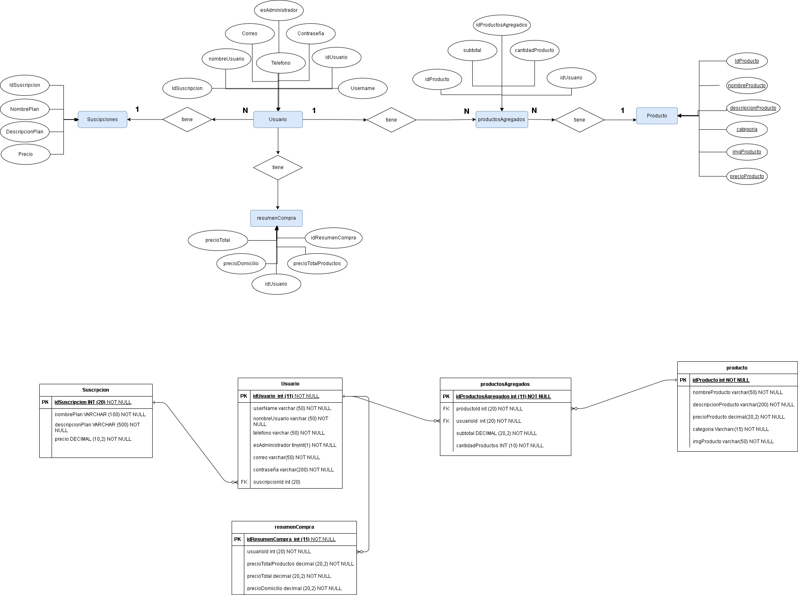

# GourmetBoxBackEnd

## Descripción del proyecto

GourmetBoxBackEnd es un proyecto backend de e-commerce basado en Spring Boot, Java y MySQL. Este proyecto constituye la parte del servidor de la tienda en línea Gourmet Box y se encarga de gestionar la información de usuarios y productos.

## Enlaces

*   **Front-end:** [https://johnalexf.github.io/GourmetBox/index.html](https://johnalexf.github.io/GourmetBox/index.html)
*   **Repositorio del Front-end:** [https://github.com/johnalexf/GourmetBox](https://github.com/johnalexf/GourmetBox)

## Funcionalidades

El proyecto se enfoca en las siguientes funcionalidades:

*   **Gestión de usuarios:**
    *   Verificación de usuario (`GET /usuario/verificar/{userName}/{contraseña}`)
    *   Obtener información de un usuario (`GET /usuario/obtener/{id}`)
    *   Creación de usuario (`POST /usuario/crear`)
    *   Actualización de usuario (`PUT /usuario/editar/{id}`)
*   **Gestión de productos:**
    *   Obtener lista de productos (`GET /producto/traer`)
    *   Creación de producto (`POST /producto/crear`)
    *   Actualización de producto (`PUT /producto/editar/{id}`)
    *   Eliminación de producto (`DELETE /producto/borrar/{id}`)

## Diagrama base de datos 


## Próximos pasos

Se planea expandir el proyecto para incluir la funcionalidad de carrito de compras, permitiendo a los usuarios guardar los productos que desean adquirir.

## Guía de inicio rápido

Para ejecutar el proyecto localmente, sigue estos pasos:

1.  **Clona este repositorio:**

    ```bash
    git clone [https://github.com/johnalexf/gourmetBoxBackEnd.git](https://github.com/johnalexf/gourmetBoxBackEnd.git)
    ```

2.  **Crea una base de datos:** Utiliza phpMyAdmin (o cualquier otra herramienta de gestión de bases de datos) para crear una base de datos vacía llamada `gbox`.

3.  **Configura la conexión a la base de datos:** Abre el archivo `application.properties` (ubicado en `src/main/resources`) y verifica la URL de conexión a tu base de datos. Asegúrate de que coincida con la configuración de tu servidor MySQL. Ejemplo:

    ```
    spring.datasource.url=jdbc:mysql://localhost:3306/gbox?useSSL=false&serverTimeZone=UTC
    spring.datasource.username=tu_usuario_mysql  # Reemplaza con tu usuario de MySQL
    spring.datasource.password=tu_contraseña_mysql  # Reemplaza con tu contraseña de MySQL
    ```

4.  **Configura la autorización al front-end:** Abre el archivo `WebConfig.java` (ubicado en `src/main/java`) y verifica la URL de conexión a tu front-end. Ejemplo:

    ```java
    .allowedOrigins("[URL]") // La URL es la de tu front-end local
    ```

5.  **Crea las tablas:** Ejecuta los scripts SQL ubicados en la carpeta `tarea11/script` para crear las tablas necesarias en tu base de datos.

6.  **Inicia la aplicación:** Ejecuta la clase `GourmetBoxBackendApplication` (puedes hacerlo desde tu IDE o usando Maven con el comando `mvn spring-boot:run`).

7.  **Prueba la aplicación:** Utiliza Postman (o cualquier otra herramienta para realizar solicitudes HTTP) para verificar el funcionamiento de las APIs. Los ejemplos de solicitudes se encuentran en la carpeta `/tarea12y13`.

## Tecnologías utilizadas

*   Java
*   Spring Boot
*   MySQL

## Dependencias

El proyecto utiliza las siguientes dependencias (puedes consultar el archivo `pom.xml` para obtener la lista completa y las versiones):

*   Spring Web
*   Spring Data JPA
*   MySQL Connector

## Despliegue

Este proyecto está desplegado en Railway y la base de datos en Amazon AWS en una instancia RDS con MySQL.

## Colaboradores

*   María Fernanda Saavedra
*   Rafael Antonio Arteaga
*   John Alexander Forero
*   Eduard Andres Idrobo

## Agradecimientos

Agradecemos a Generation Colombia por la oportunidad de participar en el bootcamp Desarrollador Web Full Stack Java, donde nació la idea de este proyecto como presentación final.


